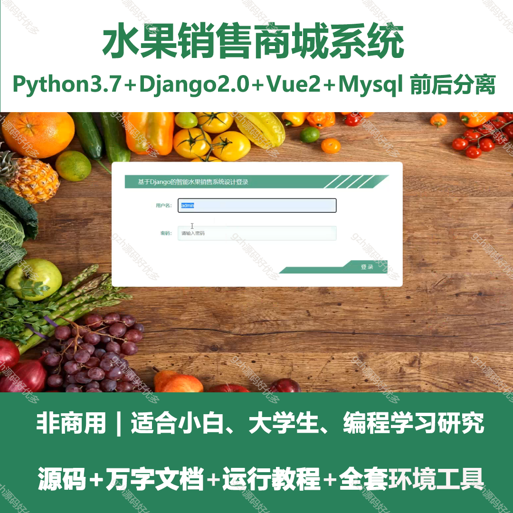
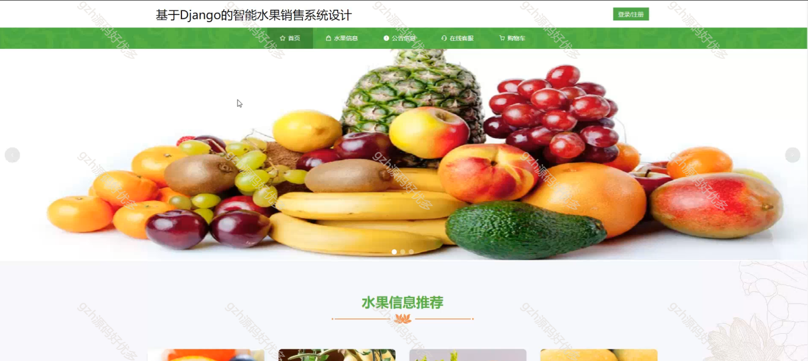
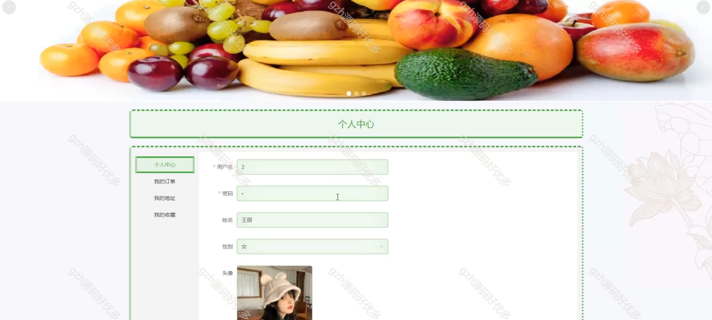
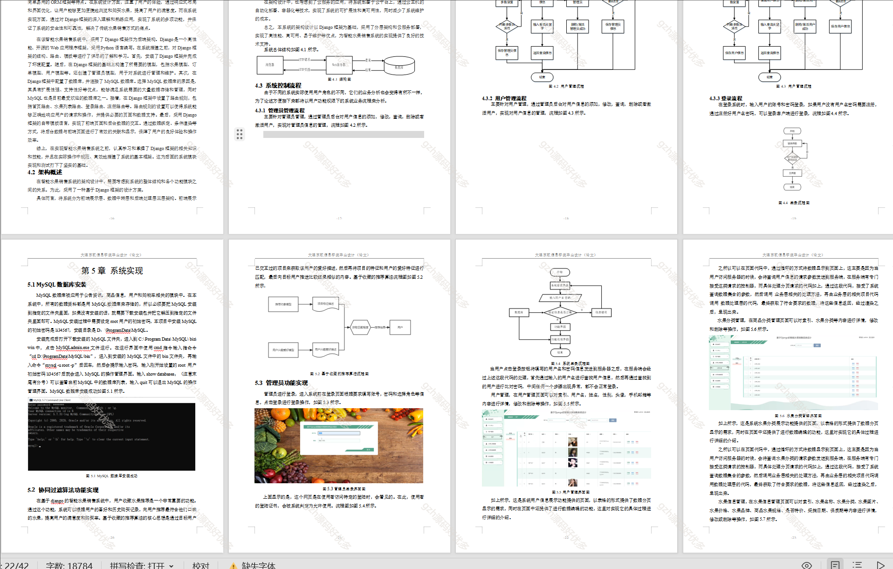
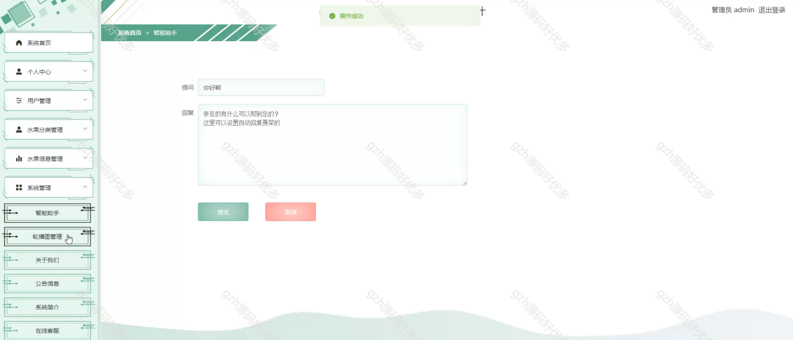
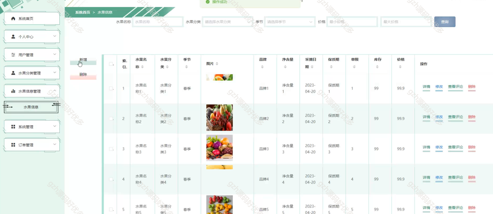
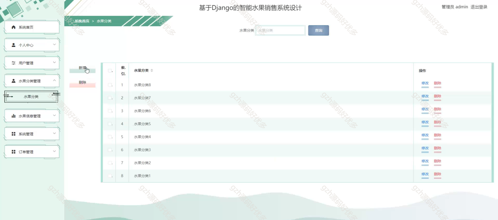
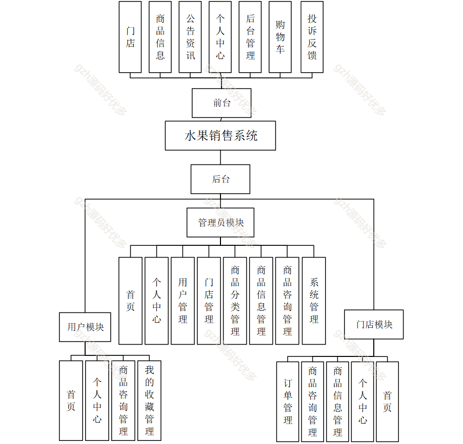
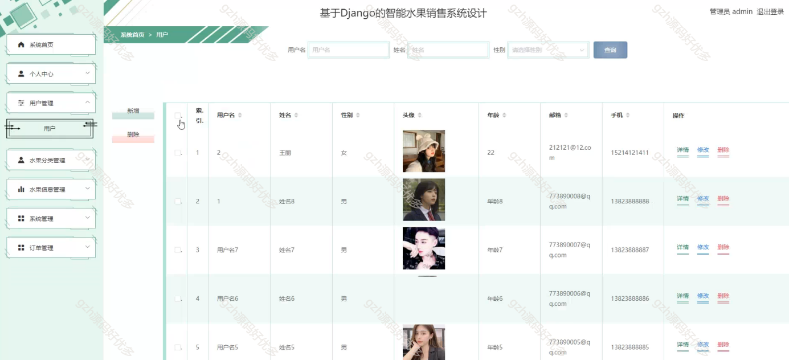

# python023
python023基于Django的水果销售商城系统
 
## 查看主页获取源码

### 一、关键词

水果销售系统，水果商城，水果店系统

 

### 二、作品包含

源码+数据库+设计文档万字+全套环境和工具资源+部署教程

 

### 三、项目技术

前端技术：Html、Css、Js、Vue2.0、Element-ui
后端技术：Python3.7、Django2.0

  

 

### 四、运行环境（以下版本亲测，其他版本未知，请自测）

开发工具：PyCharm + VSCODE

数据库：MySQL5.7（最低要5.7版本）

数据库管理工具：Navicat10+

Python：Python3.7

前端Nodejs：14

浏览器：谷歌浏览器

 

### 五、项目介绍

项目编号：python023

随着互联网技术的不断发展，电子商务已成为人们常用的消费方式之一。但是，目前市场上的水果销售系统还存在一些不足之处，如商品信息不够完善、用户体验不够优质等问题。本研究旨在通过基于Django框架的智能水果销售系统设计，改善传统水果销售系统的不足之处，提高用户体验和销售效率。

水果销售系统前台支持门店、商品信息等浏览及购物、反馈；后台管理员可管理用户、门店、商品等多类信息与系统；用户模块能操作首页、个人中心等，门店模块可处理订单、商品咨询等，实现水果销售全流程管控 。

 

### 六、运行截图

